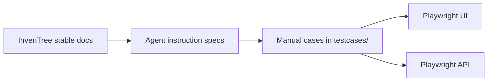
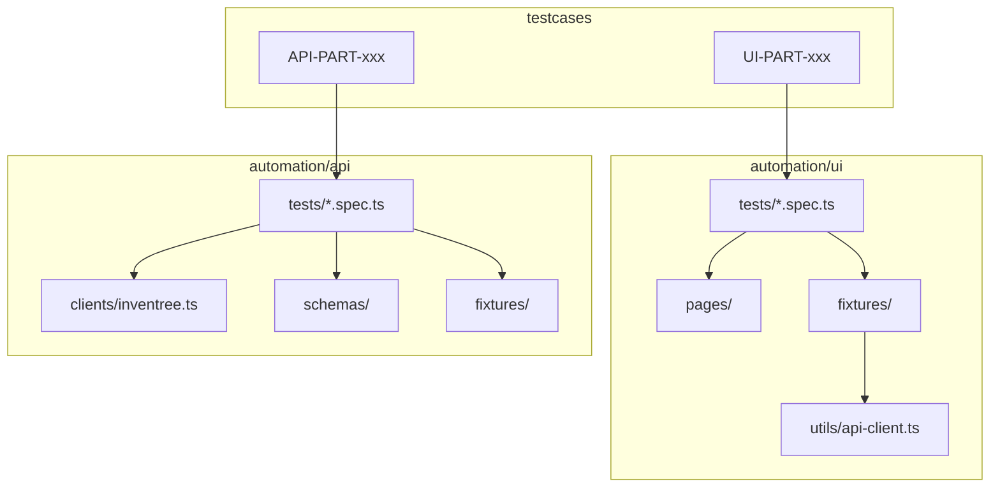

# AgentQA Strategy

How this project was designed and built: process first, then architecture.

The goal is a **repeatable, documentation-grounded** test system for the InvenTree **Parts** module — not a one-off script dump. Manual cases define the contract. Automation implements a subset of that contract. Anything the product docs do not state is flagged, not invented.

---

## 1. Approach

Work went **specification → manual cases → automation**, in that order. Each phase has its own instruction file in `agents/` so the same process can be re-run or extended without relying on chat history.

| Phase | Instruction spec | Output |
|---|---|---|
| 1. UI functional design | [`agents/01_UI_FUNCTIONAL_TEST_SPEC.md`](agents/01_UI_FUNCTIONAL_TEST_SPEC.md) | [`testcases/`](testcases/) UI files, `UI-PART-001`–`270` |
| 2. API functional design | [`agents/02_API_FUNCTIONAL_TEST_SPEC.md`](agents/02_API_FUNCTIONAL_TEST_SPEC.md) | [`testcases/`](testcases/) API files, `API-PART-001`–`250` |
| 3. UI automation | [`agents/03_UI_AUTOMATION_INSTRUCTIONS.md`](agents/03_UI_AUTOMATION_INSTRUCTIONS.md) | [`automation/ui/`](automation/ui/) Playwright + TypeScript |
| 4. API automation | [`agents/04_API_AUTOMATION_INSTRUCTIONS.md`](agents/04_API_AUTOMATION_INSTRUCTIONS.md) | [`automation/api/`](automation/api/) Playwright API + TypeScript |

Rules that applied in every phase:

- **Docs are the source of truth.** UI: [Parts](https://docs.inventree.org/en/stable/part/). API: [schema 530](https://docs.inventree.org/en/stable/api/schema/part/) and [API overview](https://docs.inventree.org/en/stable/api/).
- **Do not invent behavior.** Missing status codes, nested `$ref`s, or product settings not on the schema page are marked **Needs clarification** / **Needs verification**.
- **Manual first.** Automation is not written until cases exist and IDs are stable.
- **Traceability.** Every automated test cites `// Covers: UI-PART-xxx` or `// Covers: API-PART-xxx`.
- **Independence.** Tests do not rely on execution order. Data is unique per run (`QA-UI-…`, `QA-API-…`) and cleaned up in teardown.

---

## 2. Process



### Phase 1–2 — Design the cases

1. Read the official Parts UI pages and the Parts API schema (not a local fork of InvenTree).
2. Split coverage by **feature** (UI) and **endpoint group** (API), not by a single giant file.
3. For each feature/endpoint, design positive, negative, boundary, validation, permission, state-transition, persistence, and error-handling cases where they apply.
4. Use a fixed table format so later automation can be generated from the same columns (ID, preconditions, data, expected result / status).
5. Quality gate: every in-scope item has at least one case; duplicates removed; undocumented assumptions listed in the index.

UI cases live in `testcases/01_*.md` … `12_*.md` with index [`testcases/ui-manual-tests.md`](testcases/ui-manual-tests.md).  
API cases live in `testcases/api_01_*.md` … `api_08_*.md` with index [`testcases/api-manual-tests.md`](testcases/api-manual-tests.md).

`testcases/` is the **canonical** library. `agents/` holds the specs that produced it, not the cases to maintain day to day.

### Phase 3–4 — Automate a high-value slice

Not every manual case is automated. The instruction specs require the **highest-value functional paths** first:

- UI: CRUD, creation/validation, detail tabs, categories, attributes, parameters, revisions, negatives, one cross-functional flow.
- API: Part and category CRUD, list filters, field validation, relationship integrity, auth/403, supporting endpoints (related, templates, requirements, serials, pricing).

Automation maps to manual IDs; it does not replace the remaining manual set. Import wizards, stocktake, and nested write-only objects with unclear schema stay in the case library until the contract is clear.

### Framework choice

Both suites use **Playwright + TypeScript**.

- UI already required Playwright and Chromium.
- API originally started as pytest + requests, then was **replaced** with Playwright `APIRequestContext` so the repo has one language, one runner, and shared env-var names.
- API tests do **not** launch a browser. UI tests do.

---

## 3. Architecture

Suites are **separate Node projects**. They can be installed and run on their own. They share env var names (`BASE_URL`, `INVENTREE_USERNAME`, `INVENTREE_PASSWORD`, optional readonly user) so the same InvenTree instance can host both.



### UI automation (`automation/ui/`)

| Layer | Role |
|---|---|
| `tests/` | Scenarios. Assert **visible UI**, navigation, validation, persistence. |
| `pages/` | Page Object Model: login, parts list, part form, part detail. |
| `fixtures/` | Auth storage, page objects, unique `testPrefix`, shared API helper. |
| `utils/api-client.ts` | Seed and **cleanup only**. The behavior under test still goes through `/web`. |
| `playwright.config.ts` | Chromium, `workers: 1`, setup project writes `.auth/user.json`. |

Selector strategy: InvenTree Platform UI (PUI) control names (`text-field-name`, `action-menu-add-parts`, `panel-tabs-*`), plus roles/labels. No arbitrary sleeps; inputs are blurred to flush PUI debounce.

### API automation (`automation/api/`)

| Layer | Role |
|---|---|
| `tests/` | One file per API group (CRUD, filters, validation, category, relationships, auth, supporting). |
| `clients/inventree.ts` | HTTP methods per endpoint. Auth: Token from `/api/user/token/` or `/api/user/me/token/`, else Basic. |
| `schemas/part.ts` | Required fields, paginated list vs raw array, 4xx helper. |
| `fixtures/` | Authenticated client, anonymous client, unique prefix, **tracker** that deletes related → templates → parts → categories. |
| `data/` | Shared matrices (boolean flags, lengths). |

The client defaults `limit=50` on list calls because this instance returns a raw JSON array when `limit` is omitted; the schema documents `{ count, results }`.

### Assertion policy (API)

Hard-assert only what the schema/overview documents:

| Outcome | Status |
|---|---|
| GET / PATCH / PUT | **200** |
| POST create | **201** |
| DELETE | **204** |
| Permission denied | **403** |

**400 / 401 / 404 / 409** are not on the Parts schema page. Negative tests assert **4xx / not-success**, not a guessed code.

Product behaviors observed on the running instance (deactivate before DELETE, category delete flags, required test-template description) are documented as assumptions in [`automation/api/README.md`](automation/api/README.md), not treated as the published contract.

---

## 4. Test data and isolation

- Unique names per test: `QA-UI-<suffix>` and `QA-API-<suffix>`.
- UI: create via UI or API seed; delete via API after the assertion.
- API: `tracker` records PKs and always tears down, including failed tests. Parts are unlocked and set `active: false` before DELETE.
- Serial execution (`workers: 1`) on a shared instance (for example the public demo) to reduce collisions.
- Read-only user cases skip unless `INVENTREE_READONLY_*` is set.
- Secrets stay in `.env` (gitignored). `.env.example` is the template.

---

## 5. Coverage model

```
Manual library (full design)
  UI-PART-001 … 270    feature-wise
  API-PART-001 … 250   endpoint-wise

Automated slice (high value)
  UI specs  → subset of UI IDs, still through the browser
  API specs → subset of API IDs, tagged @p1 / @p2 / @p3 and by area
```

Priority tags (`P1` in cases, `@p1` in Playwright) mark blocking paths. Automation should keep mapping comments in sync when cases are added or retired.

---

## 6. What to change next

When extending the project, keep the same pipeline:

1. Update or add a **manual case** in `testcases/` with a stable ID.
2. If the behavior is documented, automate it in the matching spec file and add `// Covers: …`.
3. If the schema is silent, leave it manual or skip with an assumption — do not encode a guessed status code.
4. Prefer new page-object / client methods over copying locators or URLs into specs.

Do not merge UI and API projects. Shared conventions (env vars, ID prefixes, Playwright) are enough; coupling install graphs is not.
